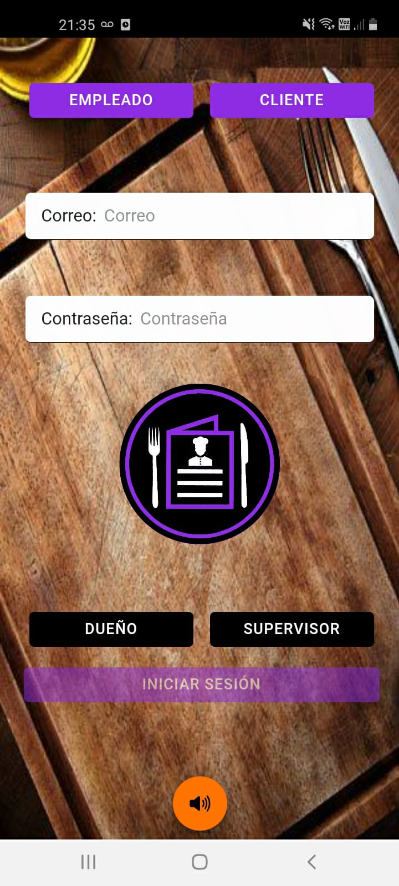
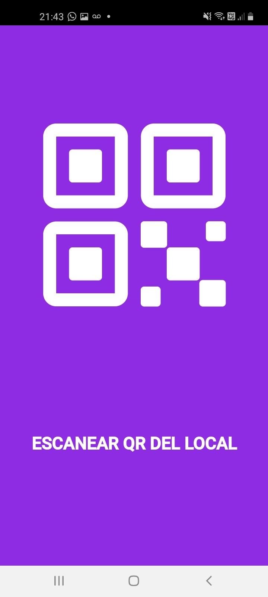
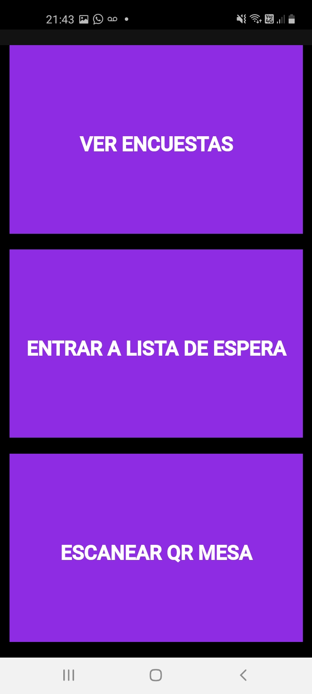
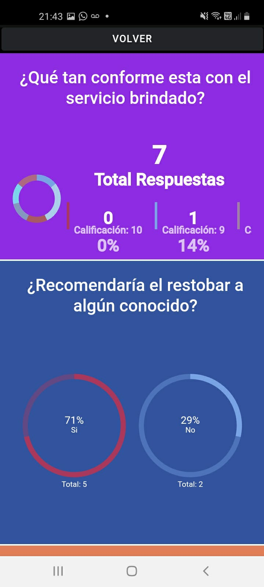

# Trabajo práctico grupal - PPS - segundo parcial - ComandaPPS

      

   

## **Primera semana**
#### **Cisa Nahuel:**
🍴 Alta Dueño  
🍴 Alta Empleado  
🍴 Encuesta Supervisor   

#### **Bustos Gil Felipe:**
🍴 Alta Cliente  
🍴 Alta Producto  
🍴 Encuesta Cliente 

#### **Balderrama Rocha Jhossymar:**
🍴 Creacion y diseño de icono, splash estatico y animado  
🍴 Alta mesa  
🍴 Encuesta Empleado 

 

## **Segunda semana**
#### **Cisa Nahuel:**
🍴 Push notification ingreso al local  
🍴 Push notification confirmar realizacion del pedido(por parte del cocinero o bartender)  
🍴 Home Supervisor/dueño  
🍴 Realizar pedidos (platos y bebida)  

#### **Bustos Gil Felipe:**
🍴 Push notification agregar cliente nuevo  
🍴 Home metre (asignación de mesa)  
🍴 Home mozo  
🍴 Home cliente 

#### **Balderrama Rocha Jhossymar:**  
🍴 Push notification confirmar pedido(parte del mozo)  
🍴 Push notification consulta a mozo
🍴 Confirmación de pedidos cocinero/ bartender
🍴 Encuesta Empleado (terminado)
🍴 Alta mesa (Se agrego funcionalidades de generador de QR de la Mesa y un generador de Imagen(del QR)) ((terminado))
  
 

## **Tercer semana**
#### **Cisa Nahuel:**
🍴 Cliente pide la cuenta  
🍴 Escaneo de QR de propinas  
🍴 Mozo confirma el pago y libera la mesa  
🍴 Juego TA TE TI (funcionalidades terminado)  

#### **Bustos Gil Felipe:**
🍴 Consultar al mozo (chat)  
🍴 Push notification consultar al mozo  
🍴 Home cliente terminado  
🍴 Sonidos en partes clave (ingreso, errores, success)  
🍴 Juego Aproxima2 (funcionalidades terminado)  

#### **Balderrama Rocha Jhossyma:**  
🍴 Mostrar encuestas  
🍴 Home Mozo, cocina, bartender (funcionalidades de listado y confirmaciones)  
🍴 Diagrama Funcionalidad de Sitema Comanda  
🍴 Imagenes de Fondo Login  
🍴 Se creo y diseño el Input del Chat (Mozo - Cliente)  
🍴 Juego Piedra Papel Tijera (funcionalidades terminado)  
🍴 Graficos (charts) Encuestas Clientes (terminado)  

 

## **Cuarta semana**
#### **Cisa Nahuel:**
🍴 Correcciones

#### **Bustos Gil Felipe:**
🍴 Correcciones

#### **Balderrama Rocha Jhossyma:**
🍴 Correcciones tema estilos, fuentes, colores, tamaños,etc.

 

---

 

## **Tour del cliente**
<pre>
                     

                     

                     

                     

                     

                     
</pre>
 
## **Pantallas de empleados**
<pre>
                     
</pre>

 
